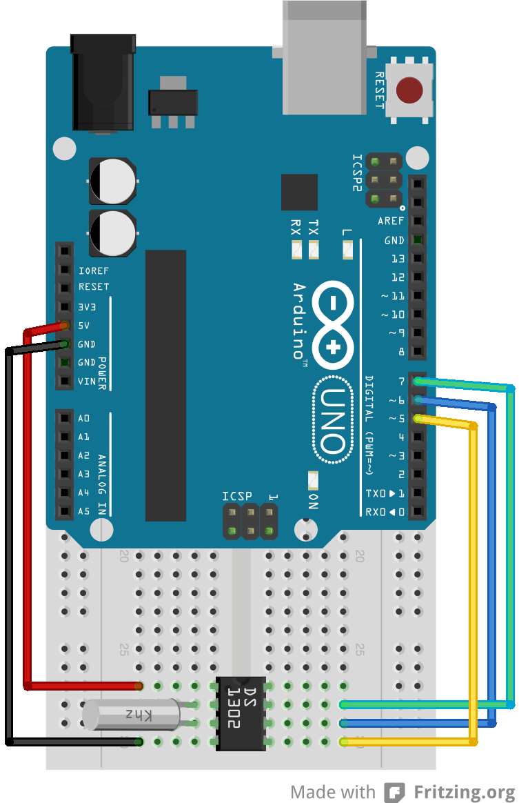

# DS1302 library examples

Try the `set_clock.ino` sketch to understand how to use the DS1302 library. The
hardware configuration for the sketch is as follows:

The crystal oscillator connected between pins 2 and 3 of the DS1302 must be
32.768KHz.
